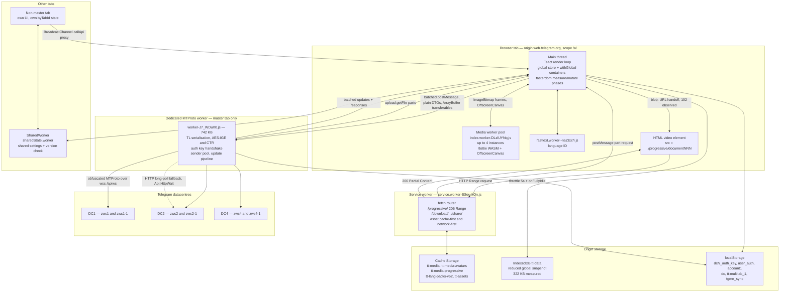
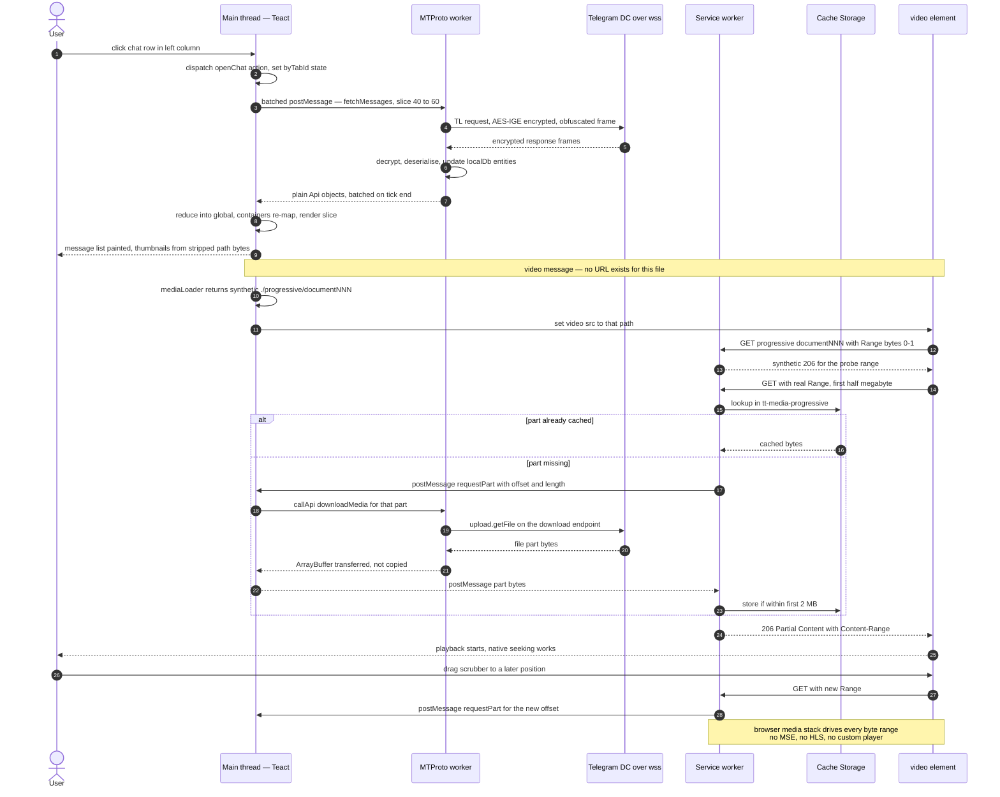

# 03 — Runtime Architecture

**Subject:** Telegram Web A, `https://web.telegram.org/a/`, version **12.0.38** (build 2026-08-11 15:24:14 UTC)
**Audit date:** 2026-08-14
**Evidence base:** an authenticated live session driven with Playwright against the production deployment; the public GPLv3 source (`Ajaxy/telegram-tt`, HEAD `d915b1b9`); 461 JS chunks and 453 source maps fetched from the deployment; six timed cold loads plus warm-reload and throttled runs.

**Confidence tags used throughout:** **Confirmed** (directly observed in source, headers, requests or runtime behaviour during this audit) · **Strong inference** (follows necessarily from two or more confirmed facts) · **Possible** (consistent with evidence, alternatives exist) · **Unknown** (not observable from where we stood).

**Standing limitation, stated once and true everywhere below:** we have **no access to Telegram's server implementation**. Every server-side claim in this document is an inference from client code, wire behaviour, or Telegram's published protocol documentation. Nothing here describes what Telegram's servers actually do internally.

**Environment caveat on timings:** the capture container's egress proxy rejected Chromium's TLS ClientHello, so a TLS-terminating local relay was inserted and HTTP/2 was disabled. Structural findings (what loads, what is stored, which protocol is used, how many bytes) are unaffected. Latency numbers are pessimistic and not production-representative.

---

## 1. Process and thread topology

### 1.1 The execution contexts that exist

| Context | Artifact | Size (raw / gzip) | Lifetime | Role |
|---|---|---:|---|---|
| Main thread | `assets/index-IZ97MA_m.js` + 20 modulepreloaded chunks | 636,791 / 266,948 B | tab | Teact render loop, global store, DOM, `fasterdom` phase scheduler |
| **MTProto worker** (dedicated, `type: 'module'`) | `worker-J7_WDuX0.js` | **742,096 / 240,922 B** | master tab only | Entire GramJS client: TL serialisation, AES-IGE/CTR, auth-key handshake, connection pool, update pipeline |
| Service worker | `service.worker-BSeu-kQn.js` | 9,609 B | origin scope `/a/` | Asset caching, `/progressive/` Range server, `/download/`, `/share/`, Web Push |
| Media worker pool (dedicated ×N) | `index.worker-DLzlUYNq.js` | 7,911 B entry | tab | tlottie `.tgs` rasterisation + OffscreenCanvas blur/appendix colour, multiplexed on one channel |
| Language-ID worker (dedicated) | `fasttext.worker--naZEx7i.js` | 64,400 B | on demand | fastText language detection for translate offers |
| Shared state (**SharedWorker**) | `sharedState.worker-zNhJnNN3.js` | 1,736 B | origin | Cross-tab shared settings and app-version reconciliation |
| Opus workers (dedicated ×2) | `decoderWorker.min.wasm` (137,424 B) + wave worker | — | on demand | Voice-note decode/encode |

**Confirmed** for the first five rows: all were observed live — the SW registration reported `state: "activated"` with script URL `service.worker-BSeu-kQn.js`, and `index.worker-DLzlUYNq.js` was fetched **twice** on the login screen, i.e. at least two media-worker instances exist before authentication. Worker pool sizing in source is `MAX_WORKERS = Math.min(navigator.hardwareConcurrency || 4, 4)` (**Confirmed in source**).

The MTProto worker is **45% of all decoded JS on the login screen** and is the largest single asset in the deployment. It is not requested until the app boots the connection — measured start ≈2.8 s into a cold load, which puts it on the critical path to a usable login screen (**Confirmed**; see `screenshots/filmstrip-3000ms.png` through `screenshots/filmstrip-9000ms.png`).

### 1.2 What crosses each boundary, and why

**Main thread ↔ MTProto worker.** The rule is stated by the authors and enforced by the code: GramJS objects never leave the worker.

- Only **plain serialisable DTOs** cross — the `Api*` types in `src/api/types`, produced by `apiBuilders/buildApi*` on the way out and consumed by `gramjsBuilders/buildInput*` on the way in (**Confirmed in source**, 23 builder files).
- A DEBUG-time assertion in `connector.ts` verifies responses contain no `VirtualClass` instances, i.e. no TL object leaked (**Confirmed in source**).
- Messages are **batched once per microtask tail** in both directions: `throttleWithTickEnd` accumulates `pendingPayloads` and flushes a single `postMessage({ payloads })`; the worker side symmetrically prepends batched `updates` (**Confirmed in source**).
- Binary payloads use **transferables** — `postMessage(data, transferables)` keyed off `response.arrayBuffer`, so file parts move without a structured-clone copy (**Confirmed in source**).
- Requests are correlated by `messageId` in a `Map<string, RequestState>`; long operations get progress callbacks via `methodCallback` messages with a `cancelProgress` path (**Confirmed in source**).

Why this boundary is where it is: MTProto forces per-message AES-IGE encryption, SHA-256, RSA and TL (de)serialisation on **every** frame including every 512 KB file part. Doing that on the main thread would collide with the render loop on exactly the frames where media arrives. Putting it in a worker also means the 742 KB of crypto and schema code is never parsed on the main thread (**Strong inference**, supported by the authors' own note: *"We use GramJS inside a web worker; UI code uses plain objects"*).

**Main thread ↔ service worker.** Two channels: normal HTTP fetches the SW intercepts (`/progressive/`, `/download/`, `/share/`, plus asset strategies), and `postMessage` — the SW cannot call the MTProto worker directly, so a Range request is converted into a `postMessage` to the controlled page, which forwards it to the API worker and posts the bytes back (**Confirmed in source**, `serviceWorker/progressive.ts`).

**Main thread ↔ media workers.** `ImageBitmap` frames and OffscreenCanvas handles, over a generic RPC layer (`PostMessageConnector` / `createPostMessageInterface`) with a `channel` string so tlottie and offscreen-canvas multiplex a single worker (**Confirmed in source**).

**Tab ↔ tab.** `BroadcastChannel` for API proxying from non-master tabs, plus a `SharedWorker` for shared settings (§7).

### 1.3 The consequence for taskrgram

The valuable, protocol-independent shape here is: **one worker owns the network and all binary work; the UI thread only ever sees plain JSON-shaped objects; messages between them are batched per microtask and use transferables for bytes.** That is worth copying even over a REST/WebSocket JSON backend, where it costs almost nothing to arrange and buys you a main thread that never parses a large response.

---

## 2. Transport

### 2.1 What was measured

Every WebSocket event in the authenticated session was logged from the browser side. Aggregate:

| Endpoint | Events |
|---|---:|
| `wss://zws1.web.telegram.org/apiws` | 512 |
| `wss://zws4.web.telegram.org/apiws` | 204 |
| `wss://zws4-1.web.telegram.org/apiws` | 116 |
| `wss://zws2.web.telegram.org/apiws` | 93 |
| `wss://zws2-1.web.telegram.org/apiws` | 43 |
| `wss://zws1-1.web.telegram.org/apiws` | 35 |
| **Total** | **1,003** |

```
opens: 17   closes: 16
frames sent:  310  =     85,464 bytes   (max single frame   4,764 B)
frames recv:  660  = 10,026,931 bytes   (max single frame 218,940 B)
```

(310 + 660 + 17 + 16 = 1,003, so the per-endpoint table and the frame counts are the same population.) **Confirmed.**

### 2.2 What the 117:1 asymmetry means

Downstream bytes exceed upstream by **117.3×** (10,026,931 / 85,464). Mean received frame is **15,192 B**; mean sent frame is **276 B**. Meanwhile the HTTP side of the same session was 737 responses, of which **635 were images**, **102 were `blob:` URLs**, and **zero were third-party hosts**.

Read together, these numbers say something specific and architecturally decisive:

- **Media does not arrive over HTTP.** There is no image CDN, no signed media URL, no ``. Photos, video, stickers and avatars come down **inside the MTProto WebSocket** as `upload.getFile` chunks, are reassembled in the worker, and are handed to the DOM as `blob:` URLs (the 102 `blob:` responses) or through the service worker's synthetic HTTP (§4). **Confirmed** at the level of "10 MB came down the socket and 102 blob URLs were consumed"; **Strong inference** for the exact `upload.getFile` call shape, which is read from source, not from decrypted frames.
- **Upstream is control traffic only.** 276 B average per sent frame is RPC calls and acks, not content.
- **The client is a protocol endpoint, not an HTTP client.** Its bandwidth profile is that of a torrent leech, not a web page.

This is the single biggest structural difference from a conventional web chat app, and it is not a choice the client made — it is forced by the protocol (§3).

### 2.3 Endpoint structure and parallel connections

Six distinct hosts were live in one session across three DCs (1, 2, 4), in two families: `zwsN` and `zwsN-1`. In source, `getDC(dcId, downloadDC)` returns `zws${dcId}${downloadDC ? '-1' : ''}.web.telegram.org:443`, so **`zwsN-1` is the download endpoint for DC N** and `zwsN` is the main endpoint (**Confirmed in source**; the live host set matches exactly). `DEFAULT_DC_ID = 2`, TL layer **227**.

The client therefore holds **several authenticated MTProto sessions at once** — one for updates on the home DC, others borrowed for file transfer, potentially on foreign DCs after `auth.exportAuthorization` / `importAuthorization`. Source shows the pool explicitly: `_exportedSenderPromises[dcId][index]`, a ref counter, and release timeouts. A per-DC bandwidth governor caps it:

```
MAX_CONCURRENT_CONNECTIONS          = 3      (premium: 6)
MAX_ACTIVE_REQUEST_SIZE             = 9 MB   (premium: 20 MB)
DOWNLOAD_WORKERS = 16, UPLOAD_WORKERS = 16
```

**Confirmed in source.** The 17 opens / 16 closes observed in a few minutes of ordinary browsing are consistent with senders being borrowed and released rather than held forever (**Strong inference**).

**No DC IPs are hardcoded anywhere in the bundle** — no `149.154.x.x`, no `venus`/`pluto`/`aurora` hostnames. The only literal transport strings are the path suffixes `/apiws`, `/apiws_test`, `/apiws_premium`; the URL is templated at runtime from server-supplied config (**Confirmed** by grepping all 461 chunks). This matches the CSP's `connect-src wss://*.web.telegram.org`.

### 2.4 Obfuscation

The WebSocket carries MTProto **transport obfuscation**, not raw framing: a 64-byte random header seeds AES-CTR streams in both directions, and candidate headers are rejected if they begin with a prefix that would look like another protocol — `HEAD`, `POST`, `GET `, `OPTI`, the TLS record prefix `16030102`, `dddddddd`, `eeeeeeee` (**Confirmed in source**, `TCPObfuscated.ts`, with the spec URL cited in the comment). Packet framing is the Abridged codec. Telegram's own documentation states obfuscation is *required* for WebSocket transports.

Practical consequence: **the frames are opaque to any middlebox and to this audit.** We can count and size them; we cannot read them. Everything about message content and RPC method names in this document comes from source reading, never from decrypted traffic.

### 2.5 HTTP long-poll fallback

A second transport exists: `HttpConnection` over `HttpStream` (fetch-based, `REQUEST_TIMEOUT = 10000`) with `shouldLongPoll = true`, driving `Api.HttpWait` frames with `LONGPOLL_MAX_WAIT = 3000`, `LONGPOLL_MAX_DELAY = 500`, `LONGPOLL_WAIT_AFTER = 150` (**Confirmed in source**). So the answer to "push or poll" is: **push over an obfuscated WebSocket normally; MTProto HTTP long-poll only when WebSockets are unavailable or blocked.**

During the unauthenticated performance runs the proxy broke WSS entirely (`code 1006`, and `POST https://zws2.web.telegram.org/apiw1` aborted) and the app logged *"Using fallback connection"* — the fallback path is real and reachable, though in that environment it did not complete (**Confirmed** that the path is taken; **Unknown** whether it would have succeeded on a clean network).

### 2.6 Reconnect behaviour actually observed

From 162 console events in the authenticated session (154 warnings, 6 errors, 2 logs), deduplicated:

```
[error]   Socket zws4.web.telegram.org closed. Code: 1006, reason: , was clean: false
[error]   Socket zws1-1.web.telegram.org closed. Code: 1006, reason: , was clean: false
[error]   Error: Not connected  at Jr.recv (worker-J7_WDuX0.js:2136:30740) at async e._recvLoop
[error]   Error: Not connected  at Jr.send (worker-J7_WDuX0.js:2136:30597) at e._sendLoop
[warning] Error: TIMEOUT  at worker-J7_WDuX0.js:2136:145416
```

The closures are environment artifacts of the relay, but they are useful evidence: after each `1006`, the worker logged `TIMEOUT`, retried, and **the session survived — no re-login, no page reload, no user-visible interruption** (**Confirmed**). The auth key lives in storage independent of any socket, so a dropped connection is a reconnect, never a re-authentication. **No application-level JS exception was thrown during the entire authenticated walkthrough**; everything in the console was transport or GPU.

The retry taxonomy in source is unusually complete and worth reading as a checklist: `ServerError`, `RPC_CALL_FAIL`, `RPC_MCGET_FAIL`, `/INTERDC_\d_CALL(_RICH)?_ERROR/` (sleep 2 s), `FloodWaitError` (sleep if within `floodSleepLimit`, else rethrow), `PhoneMigrate|NetworkMigrate|UserMigrate` (→ `_switchDC`), `MsgWaitError`, `CONNECTION_NOT_INITED`, `TimedOutError` (**Confirmed in source**).

---

## 3. Why there is no REST or GraphQL API

### 3.1 What MTProto actually is

MTProto is not an HTTP API with a binary encoding bolted on. Per Telegram's published specification it is three layers: a **high-level RPC layer** where every query and response is an object in the **TL (Type Language) schema** serialised to binary; a **cryptographic layer** that encrypts each message before it reaches the transport; and a **transport layer** (TCP, WebSocket, HTTP…). The client must complete a Diffie–Hellman **authorization key** exchange (with PQ factorisation and RSA) *before any API call is possible*.

Everything below follows from that, and each item is visible in this client's code:

1. **TL serialisation, generated, versioned.** The schema is a build artifact (`npm run gramjs:tl` regenerates from `src/lib/gramjs/tl/static/api.tl`); the deployed client announces **layer 227** via `InvokeWithLayer`. A schema bump is a client rebuild, not a header negotiation. **Confirmed.**
2. **Mandatory client-side cryptography.** AES-IGE for messages, AES-CTR for transport obfuscation, SHA-256, RSA, DH. `src/lib/gramjs/crypto/{IGE,CTR,AuthKey,RSA,Factorizator}`, handshake in `network/Authenticator.ts`. **Confirmed in source.**
3. **Stateful session semantics.** `msg_id`, `seq_no`, server salts, acks, containers, replay protection (`consumeMessageReplay`), `MAX_FUTURE_SERVER_SALTS`, `MAX_MESSAGE_IDS = 8192`, `MAX_RECENT_ACKNOWLEDGED_MESSAGES = 500`. There is no such thing as a stateless request here. **Confirmed in source.**
4. **DC migration is a client responsibility.** `PHONE_MIGRATE_X` / `NETWORK_MIGRATE_X` / `USER_MIGRATE_X` errors require the client to reconnect elsewhere and replay the query. Auth keys are **server-bound** — the client's own comment: *"authKey's are associated with a server, which has now changed so it's not valid anymore. Set to None to force recreating it."* Cross-DC access needs `auth.exportAuthorization` / `importAuthorization`. **Confirmed in source.**
5. **Files are not addressable by URL.** A file is identified by `(dc_id, file location, file_reference)` and downloaded as `upload.getFile` parts from the DC that holds it. `file_reference` values expire and must be refreshed from a fresh message/entity fetch. There is no URL to put in an ``. **Confirmed in source and in the published protocol docs; the runtime consequence — 10 MB down the socket, 102 blob URLs, zero media CDN hosts — is Confirmed by measurement.**
6. **Update delivery is a gap-recovery problem, not an event stream.** The client implements the full `pts`/`seq` continuity algorithm itself, with per-channel sorted queues and difference recovery (`SHORTPOLL_CHANNEL_DIFFERENCE_LIMIT = 100`, `CATCH_UP_CHANNEL_DIFFERENCE_LIMIT = 1000`, retry 5 s). **Confirmed in source**, 1,223 LOC in `mtpUpdateHandler.ts` alone.

### 3.2 Comparison table

| Concern | Conventional REST/WebSocket chat app | Telegram Web A | What it costs the client |
|---|---|---|---|
| Request encoding | JSON over HTTP, self-describing, `curl`-able | TL binary object, schema-versioned (layer 227) | A generated schema + serialiser must ship in the bundle |
| Credential | Cookie or bearer token, attached by browser or fetch wrapper | 256-byte MTProto **auth key per DC**, used to encrypt every message | Key management, per-DC key set, no browser help |
| Auth bootstrap | POST /login → token | DH key exchange with PQ factorisation, then login RPC | RSA + big-int + factorisation code on the client |
| Session | Stateless requests, server holds session | Stateful: msg ids, seq no, salts, acks, replay window | Full session state machine in the client |
| Endpoint discovery | One base URL, DNS + CDN handles the rest | `help.getConfig` → DC options; migration errors force reconnects | Connection pool, DC router, migration handling |
| Media fetch | ``, browser does caching, Range, decode | `upload.getFile` parts over the same encrypted socket | Service worker acting as a local HTTP media server (§4) |
| Media addressing | Stable URL | `(dc_id, location, file_reference)`, references expire | Re-resolution logic; no shareable URL exists client-side |
| Realtime updates | Server pushes events; missed events usually re-fetched wholesale | pts/seq boxes with client-side gap detection and `getDifference` | ~1,900 LOC of update-pipeline code |
| Transport failure | Reconnect the socket | Reconnect **and** possibly re-handshake, re-borrow senders, resume long-poll | Larger retry taxonomy (see §2.6) |
| Offloading to CDN | Trivial and normal | Impossible for media; only static app assets can be cached edge-side | All media bandwidth is protocol bandwidth |
| Debuggability | DevTools Network tab shows everything | Frames are obfuscated and encrypted; DevTools shows opaque binary | Debug tooling must be built into the app (they pipe worker `console.*` to the page) |
| CSRF | A real concern; needs tokens or SameSite | **Structurally absent** — no ambient credential (see doc 09) | Replaced by a different threat model, not a smaller one |
| Bundle cost | A fetch wrapper, a few KB | **742 KB** worker (241 KB gzip) | 45% of decoded JS on first load |

### 3.3 The lesson, stated plainly for taskrgram

Almost none of this is a design taken for elegance; it is the cost of speaking a protocol designed for native mobile clients from inside a browser. **An internal team-chat app should not reproduce any of it.** A JSON/WebSocket API with HTTP media URLs deletes rows 1, 2, 3, 5, 6, 7, 10 and 11 of that table outright. What is worth taking from this section is the *discipline* the constraint produced — a worker-owned protocol layer, a plain-DTO boundary, and an explicit, testable update-gap policy — not the protocol itself.

---

## 4. The service worker as a media server

### 4.1 What was observed at runtime

```
206 GET https://web.telegram.org/a/progressive/document5109473995049145023
206 GET https://web.telegram.org/a/progressive/document5109473995049145021
206 GET https://web.telegram.org/a/notification.mp3
200 GET blob:https://web.telegram.org/e7c50f96-7dc4-4b23-b784-9a991e562d1a
```

`/a/progressive/document<id>` returning **HTTP 206 Partial Content** is **Confirmed at runtime**. There is no such path on Telegram's origin server — no request for it ever left the browser. The service worker manufactured those responses.

### 4.2 How a `<video>` streams a file that has no URL

The chain, from source and consistent with the observed 206s (**Confirmed in source; Strong inference for the exact per-request sequence in the live session**):

1. `mediaLoader` is asked for a video in `ApiMediaFormat.Progressive`. Instead of downloading it, it returns a **synthetic same-origin URL**: `./progressive/<mediaKey>` (`PROGRESSIVE_URL_PREFIX = './progressive/'`).
2. That string goes into `<video src>`. The browser's native media stack now believes it has an ordinary HTTP resource and issues **Range requests** against it — including the seek-driven ones a user generates by dragging the scrubber.
3. The service worker's `fetch` handler routes `/progressive/` to `respondForProgressive`, which converts the requested byte range into part requests (`DEFAULT_PART_SIZE = 0.5 MB`, `PART_TIMEOUT = 60000`), `postMessage`s them to the controlling page, which forwards them to the MTProto worker as `upload.getFile` calls.
4. The bytes come back, the SW assembles a `206 Partial Content` with the correct `Content-Range`, and the native player consumes it. The first **2 MB** of each file is cached (`MAX_END_TO_CACHE = 2 * MB - 1`).
5. A documented Safari special case short-circuits the `bytes=0-1` probe request with a synthetic 206 built from URL parameters (`// Optimization for Safari`).

The payoff: **native seeking, native buffering, native codec handling, native picture-in-picture — for content that exists only as encrypted protocol parts.** No MSE, no HLS, no DASH, no custom player. MSE appears exactly once, as a Safari-only fallback in `useStreaming.ts`, fed by an async generator with `DEFAULT_PART_SIZE = 0.25 MB` (**Confirmed in source**; grep for `hls` across the deployment returns only unrelated identifiers).

Two sibling routes use the same trick: `/download/` streams a whole file for "save as" with `Content-Disposition` and a bounded pipeline (`DOWNLOAD_PART_SIZE = 1 MB`, `QUEUE_SIZE = 8`), and `/share/` receives OS share-target intents (**Confirmed in source**).

### 4.3 The blob handoff

For everything that is *not* progressive — avatars, photos, stickers, small documents — the worker delivers the complete bytes and the main thread creates a `blob:` URL. **102 `blob:` responses were observed** in the session (**Confirmed**). Blob URLs are origin-scoped, revocable, and consume no network; they are the cheap path for anything under the 512 KB media-cache ceiling (`MEDIA_CACHE_MAX_BYTES = 512 * 1024`). Above that ceiling, the progressive path takes over — the two mechanisms are split by size, deliberately.

### 4.4 Cache Storage buckets

Five buckets were live in the authenticated session (**Confirmed** — enumerated via `caches.keys()`), and a sixth exists in source but was not created during our session:

| Bucket | Holds | Notes |
|---|---|---|
| `tt-media` | Photos, stickers, small documents ≤ 512 KB, as complete blobs | LRU-swept |
| `tt-media-avatars` | Profile and chat avatars | Separated so avatar churn cannot evict conversation media |
| `tt-media-progressive` | The first ≤ 2 MB of progressive video/audio files | Feeds the SW's Range responses without re-hitting MTProto |
| `tt-lang-packs-v52` | Language packs; 1 entry (`https://web.telegram.org/en`) even pre-auth | Version is **in the bucket name** — `v52` — so a pack-format change is a new bucket, not a migration |
| `tt-assets` | The app shell: JS, CSS, fonts, wasm, tgs | **1 entry cold → 42 entries after warm reload**; network-first with a 3 s timeout, then cache |
| `tt-custom-bg` | Custom chat wallpapers (**in source, not observed live**) | Not created in our session |

Eviction is hand-rolled rather than delegated to the browser: a `X-Last-Access` header is written on read (throttled to once per day per entry), a sweep runs hourly, entries older than **5 days** are dropped, and the sweep yields to the main thread between entries via `yieldToMain()`. Only `tt-media`, `tt-media-avatars` and `tt-media-progressive` are in `CLEARABLE_CACHE_NAMES` — the app shell and language packs are not user-clearable from "Clear Media Cache" (**Confirmed in source**).

An aside worth one line: `navigator.storage.estimate()` reported `serviceWorkerRegistrations: 9609` bytes, exactly the byte size of `service.worker-BSeu-kQn.js` (**Confirmed**, interpretation **Possible** — it is likely just the stored script).

### 4.5 SW lifecycle

`install → skipWaiting()`, `activate → clients.claim()` racing a 3 s timeout with the comment *"An attempt to fix freezing UI on iOS"* (**Confirmed in source**). The effect is measurable: on the **first** cold load of a fresh profile, `navigator.serviceWorker.controller` was already non-null — the SW takes control of the very navigation that registered it (**Confirmed**), which is what makes the warm-reload numbers in §6 as strong as they are.

---

## 5. State and persistence

### 5.1 The store

One flat, normalised global object with roughly 90 top-level slices (`users`, `chats`, `messages`, `settings`, `stickers`, `stories`, `activeSessions`, …), 50,833 LOC under `src/global/` (**Confirmed in source**). Two orthogonal scoping dimensions matter more than the slice list:

- `byTabId: Record<number, TabState>` — per-tab UI state (open chat, open modals, selections). 1,141 LOC of `tabState.ts` alone.
- `sharedState: SharedState` — settings shared across tabs, backed by the SharedWorker.

`tabId` threading is not a convention, it is enforced: a custom ESLint plugin (`eslint-plugin-tt-multitab`) plus type machinery make `tabId` **required** when one action or selector calls another (**Confirmed in source**).

### 5.2 `withGlobal` containers

The store engine is ~400 LOC (`teactn.tsx`). `withGlobal(mapStateToProps)` registers a **Container** record in a module-level `Map`; on every global change a flat loop re-runs each container's mapper and calls `forceUpdate()` only when the mapped props fail a shallow-equality check. Notable properties:

- The mapping loop lives **outside the component tree** — cost is `O(mounted containers × selector cost)` once per tick, which is why the house rules are *"no loops in selectors"* and *"selectors must be pure; don't allocate new objects or arrays"* (**Confirmed in source and `AGENTS.md`**).
- Updates are batched with `throttleWithTickEnd`, and **deferred entirely while a heavy animation is running** (`getIsHeavyAnimating()`), then flushed. The same gate suspends the Teact render pass, IndexedDB writes, IntersectionObservers and folder recomputation (**Confirmed in source**).
- DEBUG builds stamp each `getGlobal()` with a random id and **throw on a stale write** — the classic `read → await → write` async bug becomes an exception in development. ~10 lines. Steal this.
- The action queue is a **trampoline, not recursion**, with `execAfterActions()` for post-flush work.

### 5.3 The persisted snapshot

Persistence is **IndexedDB via `idb-keyval`**, database `tt-data` (**Confirmed live**: `indexedDB.databases()` → `[{ name: "tt-data", version: 1 }]`, 322,094 B used). localStorage holds only small flags and session material, never the store.

What is written is not the global state — it is a **deliberately reduced projection**, `reduceGlobal()`, which whitelists keys via `pick(global, [...])` and runs per-slice reducers with hard bounds:

```
GLOBAL_STATE_CACHE_USER_LIST_LIMIT          = 500
GLOBAL_STATE_CACHE_CHAT_LIST_LIMIT          = 200
GLOBAL_STATE_CACHE_ARCHIVED_CHAT_LIST_LIMIT = 10
GLOBAL_STATE_CACHE_CUSTOM_EMOJI_LIMIT       = 150
```

**Deliberately not persisted** (**Confirmed in source**):

- Optimistic/local media — stripped by `omitLocalMedia`, `omitLocalPhoto`, `omitLocalVideo`, `omitLocalDocument`, `omitLocalPaidReactions`, and local draft flags cleared by `clearCachedDraftLocalFlags`.
- Anything non-serialisable: the house rule is *"Global may only store serializable primitives"*.
- Message bodies beyond the bounded slices — there is **no local message database**. This is the deliberate opposite of the mobile/desktop clients, which run TDLib with a full local store. Web A keeps a slim snapshot for a fast cold start and re-fetches from the network for everything else (**Strong inference**, well supported by the limits above and the absence of any message store in `tt-data`).
- Auth keys, which live in localStorage (or, under a passcode, AES-GCM-encrypted in a separate `tt-passcode` IDB store). See doc 09.

**Write policy:** `throttle(5000)` wrapped around `onFullyIdle(...)`, and skipped outright when logging out, when caching is disabled, or when a heavy animation is in progress. So a burst of 200 updates produces at most one write per 5 s, and that write lands in an idle gap (**Confirmed in source**).

**Migration versioning:** `migrateCache(cached, initialState)` → `unsafeMigrateCache`, ~250 lines of versioned fixups, plus `migrateSharedCache`. The rule is mandatory: *"When adding a new required section to `GlobalState`, always add a corresponding entry in `migrateCache`."* (**Confirmed in source**.) This is the piece teams usually skip and then regret — a cached snapshot from an older client build is otherwise a guaranteed crash surface on every deploy.

---

## 6. Multi-tab

### 6.1 What was observed

`localStorage` contained `tt-multitab_1` with a **1-character value** — present even pre-authentication (**Confirmed** in both the authenticated session and the unauthenticated performance runs). This is the master-election flag (`MULTITAB_STORAGE_KEY`).

### 6.2 The model

- **Exactly one tab is master.** Election lives in `establishMultitabRole.ts` / `util/browser/multitab.ts`, using `navigator.locks` (present in the `compatTest.js` feature gate) and the localStorage flag; `src/index.tsx` subscribes to master changes and calls `switchMultitabRole` (**Confirmed in source**).
- **Only the master owns the MTProto worker and therefore the socket.** Non-master tabs call `callApiOnMasterTab(payload)`, which posts over a `BroadcastChannel`; the master executes the request and broadcasts the result back to the originating tab by token:

  ```ts
  const promise = isMasterTab ? makeRequest({...}) : makeRequestToMaster({ name: fnName, args });
  ```

  (**Confirmed in source**.)
- **Shared settings go through a SharedWorker** (`sharedState.worker`), separate from the per-tab `byTabId` state.
- **Version reconciliation is brutal and correct**: the SharedWorker compares each tab's app version against its own; a tab on a different build **reloads itself immediately** (`if (t !== '12.0.38') { window.location.reload(); return; }`, plus a two-way comparison that reloads the older side and pushes the newer version to the other). **Confirmed in the deployed bundle.**

### 6.3 Why only one tab may own the socket

Four independent reasons, all **Strong inference** grounded in confirmed facts:

1. **The MTProto session is stateful.** `msg_id`, `seq_no` and the salt sequence are per-session; two tabs sharing one auth key but running independent senders would generate colliding/out-of-order message ids and trip replay protection.
2. **Update continuity is a single stream.** `pts`/`seq` gap detection assumes one consumer applies updates in order. Two consumers racing on `getDifference` would both mutate the same persisted `pts` and permanently desynchronise.
3. **Cost.** Each connection is a real auth-key-encrypted session with its own handshake and its own share of the 3-connection-per-DC budget. N tabs × N sockets is wasteful and would hit flood limits.
4. **Persistence.** All tabs write to the same `tt-data` and the same localStorage keys; a single writer avoids last-write-wins corruption.

**Retrofitting this is very painful** — every action and selector in the codebase carries a `tabId`, enforced by a bespoke lint rule. If taskrgram will ever be open in more than one tab (it will), decide the ownership model on day one, even if the first implementation is trivially "the newest tab wins".

---

## 7. Caching and freshness

### 7.1 Version polling and self-update

```
200 GET https://web.telegram.org/a/version.txt?1786714476657
```

**Confirmed at runtime.** `version.txt` is fetched with a `Date.now()` cache-buster and compared against the compiled-in version; a newer value sets `isAppUpdateAvailable` in the global state, which drives the in-app update prompt:

```js
`${Date.now()}`).then(e=>e.text()).then(t=>{t=t.trim(),
  bg(t,`12.0.38`)&&(e=G(),e={...e,isAppUpdateAvailable:!0},q(e))})
```

(**Confirmed** in the deployed bundle.) This is the intended answer to a long-lived SPA going stale: a 12-byte poll, an explicit comparison, an in-app prompt, plus the SharedWorker's hard reload for version-mismatched tabs (§6.2).

### 7.2 HTTP cache headers — the one clear defect

Every response, including content-hashed immutable assets, carries `cache-control: max-age=3600` with a weak ETag. There is no `immutable`, no `max-age=31536000`, no Brotli (`Accept-Encoding: br` → identity; `br, gzip, deflate, zstd` → gzip), no HTTP/3 advertised (**Confirmed** from live headers).

The practical effect: a hashed filename can never change content, so a 1-hour TTL buys nothing and costs a revalidation storm across ~490 assets every hour. Brotli alone would cut roughly 20% off a 2.32 MiB transfer. **This is the cheapest available win in the whole deployment, and it is a server configuration change, not a code change.**

### 7.3 Warm reload, measured

| Metric | Cold | Warm reload | Change |
|---|---:|---:|---|
| Subresource requests | 48 | 44 | −4 |
| Subresource transfer | 683,895 B | **2,975 B** | **−99.6%** |
| Requests served from cache | 1 | 39 | — |
| `responseStart` | 477 ms | 145 ms | −70% |
| `first-paint` | 1,676 ms | 872 ms | −48% |
| FCP / LCP | 2,236 ms | 1,396 ms | −38% |
| `domInteractive` | 2,117 ms | 870 ms | −59% |
| `loadEventEnd` | 3,195 ms | 1,547 ms | −52% |
| Login CTA visible | 7,837 ms | 5,702 ms | −27% |
| Long tasks / TBT | 1 / 84 ms | **0 / 0 ms** | eliminated |

A repeat visitor transfers **0.4% of the cold-load bytes**. Only five resources still touch the network, totalling 2,975 B — `compatTest.js` (1,450 B) and `redirect.js` (625 B), which are unhashed and therefore not immutably cacheable, plus three 300 B worker `importScripts` revalidations. **Confirmed, byte-identical across runs.**

The residual finding matters more than the win: with bytes no longer the constraint, the login CTA still needs **5.7 s**. It is gated on the MTProto round trip, not on asset loading (see doc on performance for the environment caveat that inflates this).

### 7.4 Storage totals, measured after a few minutes of authenticated use

```json
"storageEstimate": {
  "quota": 162331904409,
  "usage": 16652983,
  "usageDetails": { "caches": 16321280, "indexedDB": 322094, "serviceWorkerRegistrations": 9609 }
}
```

**16.65 MB total, of which 16.32 MB (98.0%) is Cache Storage** — after browsing essentially one channel. IndexedDB is 322 KB, about 1.9%. **Confirmed.**

The distribution is the architecture in one number: **state is tiny and bounded; media is everything.** A conventional app with an image CDN would show close to zero here, because the browser's own HTTP cache would hold the media and would not be counted against origin quota. Because Telegram must fetch media through the protocol, it must also implement caching, eviction and quota management itself — the hourly LRU sweep in §4.4 exists because nothing else will do that job.

---

## 8. Pagination and list loading

### 8.1 Measured under scroll

Public channel @TelegramTips (11.19 M subscribers, years of history), viewport 1600×1000, `.Message` nodes counted directly in the DOM:

| Action | `.Message` nodes | `scrollHeight` | JS heap |
|---|---:|---:|---:|
| Chat opened | 29 | 20,317 px | — |
| `scrollTop` −4,000 px | 29 | 20,317 px | — |
| `scrollTop` −12,000 px | 29 | 20,317 px | — |
| `scrollTop` −25,000 px | 89 | 61,266 px | 54.6 MB |
| `scrollTop` −40,000 px | **89** | **61,266 px** | **52.3 MB** |

**Confirmed.** See `screenshots/23-desktop-message-list-scrolled-up-virtualization-test.png`.

### 8.2 What that means, and what it is not

Three observations settle the mechanism:

1. **Node count grows in discrete jumps and then stops** (29 → 89 → 89). A windowing virtualizer would hold node count roughly *constant* at all scroll positions.
2. **`scrollHeight` grows in the same jumps** (20,317 → 61,266 px) and stays. A virtualizer keeps a synthetic constant height and recycles rows inside it.
3. **Heap went down** between the last two samples (54.6 → 52.3 MB) while node count held — the older slice was released.

So this is a **bounded sliding window over loaded slices**, not react-window-style pixel virtualization. The relevant constants in source (**Confirmed**):

```
MESSAGE_LIST_SLICE          = isBigScreen ? 60 : 40
MESSAGE_LIST_VIEWPORT_LIMIT = MESSAGE_LIST_SLICE * 2      // 80–120 messages max in DOM
CHAT_LIST_SLICE             = isBigScreen ? 30 : 25
CHAT_LIST_LOAD_SLICE        = 100
SHARED_MEDIA_SLICE          = 42
DEFAULT_LIST_SLICE          = 30        // useInfiniteScroll
DEFAULT_PRELOAD_BACKWARDS   = 20
DEFAULT_SENSITIVE_AREA      = 800 px    // InfiniteScroll load-more trigger zone
```

The observed 89 sits inside the 80–120 envelope implied by `MESSAGE_LIST_VIEWPORT_LIMIT` (**Strong inference** that the cap we hit is that constant; the exact `isBigScreen` branch at 1600 px was not independently verified).

### 8.3 Why this is the right trade for a chat log

- **Messages have unknown, variable heights** — text, albums, stickers, polls, quoted replies, link previews. Pixel virtualization needs a height oracle; getting one wrong produces scroll jumps, which is the most damaging bug class in a chat UI.
- **You keep native behaviour for free**: real scrollbars with honest proportions, working find-in-page, working Ctrl+F highlight, correct anchor restoration, text selection across messages, and a sane accessibility tree.
- **The cost is a hard cap** on how much history is on screen, plus hand-written scroll anchoring. The anchoring is genuinely fiddly — `InfiniteScroll.tsx` stores `currentAnchor` / `currentAnchorTop` in a ref and restores `scrollTop` in a layout effect via `requestForcedReflow`, and `MessageList.tsx` carries explicit workarounds for a Firefox scroll-anchoring bug (bugzilla 1753188), stale Safari `IntersectionObserver` entries, and partly-loaded albums at slice edges.

The chat **list** (not the message list) uses a different technique: fixed-height rows (`CHAT_HEIGHT_PX`) rendered **absolutely positioned** at `(viewportOffset + i) * CHAT_HEIGHT_PX` inside a container of constant `maxHeight`, keyed with `teactOrderKey` so reordering is a transform rather than a reflow (**Confirmed in source**). Fixed heights make virtualization-by-arithmetic trivial — which is exactly why they did it there and not in the message list.

**For taskrgram:** copy the split. Bounded sliding window with anchor preservation for the variable-height message log; fixed-height absolutely-positioned rows for the conversation list. Reach for a virtualization library only if you can guarantee row heights.

---

## 9. Diagrams

### 9.1 Runtime topology



### 9.2 Opening a chat and streaming a video



---

## 10. What we could not see

Stated plainly, because an audit that does not bound itself is not an audit.

1. **The server.** No access to Telegram's backend. Every statement about server behaviour is inferred from client code, wire timing, or published protocol docs. **Unknown:** how DCs route, how `file_reference` is validated, what rate limits apply, how updates are fanned out.
2. **The contents of any MTProto frame.** Transport obfuscation plus per-message AES-IGE means we counted and sized frames but never read one. Every claim about *which RPC* was called at *which moment* is source-derived, not traffic-derived.
3. **Whether the deployed bundle exactly matches the public repo.** The version string (`12.0.38`), build timestamp (2026-08-11 15:24:14 UTC) and the 2,056 source paths recovered from 453 public source maps all line up with `package.json` version 12.0.38 at HEAD `d915b1b9` — strong, but not a reproducible-build proof. **Strong inference**, not Confirmed.
4. **Production network characteristics.** All timings passed through a TLS-terminating local relay on HTTP/1.1 from a US datacenter IP; measured aggregate throughput on the unthrottled baseline was only 0.45 Mbps. Byte counts, request counts, storage inventory and cache-hit behaviour are trustworthy; latencies are not.
5. **The WebSocket fallback under clean conditions.** We confirmed the app *takes* the HTTP long-poll path when WSS fails, but our environment broke both, so we never saw the fallback succeed.
6. **Multi-tab behaviour under contention.** We observed the `tt-multitab_1` flag and read the election code; we did not run two authenticated tabs and force a master handover, kill the master mid-request, or verify BroadcastChannel proxying end to end.
7. **Long-session memory behaviour.** Heap was flat over 60 s idle on the login screen (delta exactly 0 in three paired samples) and moved 54.6 → 52.3 MB during scrolling. **That is not evidence about leaks over hours of real use** in a chat with active media.
8. **Everything gated behind features we did not exercise:** calls (WebRTC, `src/lib/vibecalls`), payments (Stripe / Smart Glocal tokenisation), stories, uploads, Web Push delivery, the `/share/` target, the Tauri desktop shell, and multi-account slots (`MULTIACCOUNT_MAX_SLOTS = 6`).
9. **Real-device behaviour.** Headless Chromium on Linux with a software rasteriser. The WebGL warnings observed are environment artifacts; they confirm the app *uses* WebGL and degrades to software rather than failing, but say nothing about GPU behaviour on a real machine.
10. **Cache eviction in practice.** The 5-day TTL and hourly sweep are read from source. Our session was minutes long; we never observed an eviction.

---

## 11. The short list for taskrgram

Ordered by value-per-unit-effort, restricted to things that transfer to a conventional JSON/WebSocket internal chat app.

1. **Own the network in a worker; let only plain DTOs cross.** Batch `postMessage` per microtask; use transferables for bytes. Cheap to arrange, permanently useful.
2. **Persist a reduced, bounded, versioned snapshot** — whitelist keys, cap list sizes, strip optimistic local state, throttle writes and run them at idle, and make a migration entry mandatory for every state-shape change.
3. **Gate expensive work on animation state.** One `beginHeavyAnimation()` / `onFullyIdle()` pair that suspends store fan-out, persistence and IntersectionObservers is why this UI stays smooth during transitions.
4. **Decide the multi-tab ownership model on day one.** One writer, one socket, per-tab UI state separated from shared state.
5. **Bounded sliding window for the message log; fixed-height absolute rows for the conversation list.** Do not reach for a virtualization library unless heights are known.
6. **Poll a `version.txt`-style endpoint and reload version-mismatched tabs.** Long-lived SPAs go stale; this is twelve bytes and an afternoon.
7. **Set `cache-control: max-age=31536000, immutable` on content-hashed assets and enable Brotli.** Telegram does neither; you should do both from the start.
8. **Do not build a service-worker media server.** You will have real URLs. Use them, put them on a CDN, and let the browser's HTTP cache do the LRU work that Telegram had to hand-write.
