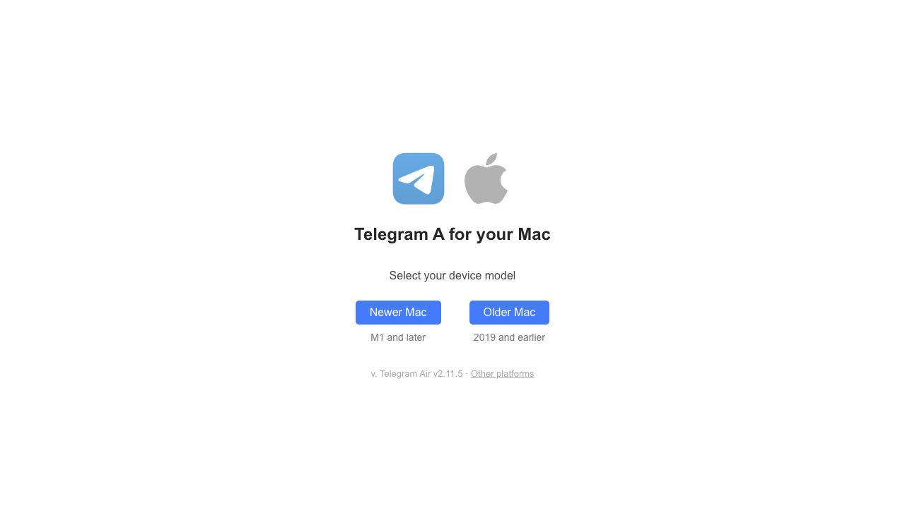

# Evidence log and methodology

## Method

- Real-browser inspection through the Codex in-app browser.
- Desktop baseline: 1280×720.
- Mobile baseline: 390×844.
- DOM accessibility snapshots and read-only computed-layout inspection.
- Passive asset inventory and console inspection.
- Public HTTP headers and asset size checks.
- Public `Ajaxy/telegram-tt` source archive. Runtime and package both reported `12.0.38`.
- Normal authenticated interactions only. No sends, uploads, setting changes, permission grants, purchases, deletions, or session termination.

## Public/auth route observations

| State | Title | URL | Key observations |
|---|---|---|---|
| QR login | Telegram | `/a/` | 280 px QR, ordered three-step instruction list, phone and passkey alternatives |
| Phone login | Telegram | `/a/` | Country field, formatted phone field, keep-signed-in checkbox, Next, QR/passkey alternatives |
| Code login | Telegram | `/a/` | Animated monkey, masked/account number display, single code field, delivery explanation |
| Main | Telegram | `/a/` | Menu, stories, search, chat list, new-message FAB, empty middle workspace |
| Conversation | Telegram | `/a/#<chat-id>` | Back/header/status, messages, jump controls, attachment/rich composer, emoji/GIF/sticker, voice |
| Settings | Telegram | `/a/` | Nested settings pane beside main settings overview at desktop width |
| Download | Telegram A for Mac | `/a/get/mac.html` | User-agent redirect from `/a/get/`; ARM/x64 choices |
| Share | Telegram | `/a/share/` → `/a/` without payload | Share Target is service-worker managed |

## Key runtime asset observations

- `index-IZ97MA_m.js`
- `rolldown-runtime-hePW80VL.js`
- `core-DFiqCqIj.js`
- `fasterdom-vRnhxblf.js`
- `teact-CUUQAb7N.js`
- `main-D0-d5I4l.js`
- `editor-CL7uxqfp.js`
- `extra-B5SMB89j.js`
- `worker-J7_WDuX0.js`
- `index.worker-DLzlUYNq.js`
- `TLottie-DQwTMw5h.js`
- `qr-code-styling-DyCNGGn8.js`
- `auth-hGmljodO.js`
- component-named CSS chunks and Roboto/Nunito/icon fonts.

These names are strong direct evidence of framework, build runtime, feature splitting, workers, animations, and UI modules.

## Key headers

Main document:

```text
HTTP/2 200
server: nginx/1.30.1
content-type: text/html
content-length: 5806
last-modified: Tue, 11 Aug 2026 15:24:14 GMT
cache-control: max-age=3600
x-frame-options: deny
x-served-by: meta...
```

Hashed JS:

```text
HTTP/2 200
content-type: application/javascript
cache-control: max-age=3600
content-encoding: gzip
etag: W/...
x-frame-options: deny
x-served-by: meta...
```

No `Set-Cookie` header was present on the main document response.

## CSP observed in HTML

Important directives:

- `default-src 'self'`
- `script-src 'self' 'wasm-unsafe-eval'` plus Telegram websync endpoints
- `worker-src 'self'`
- `style-src 'self' 'unsafe-inline'`
- `font-src 'self' data:`
- `img-src 'self' data: blob:` plus Foursquare icons
- `media-src 'self' blob: data:`
- `object-src 'none'`
- `base-uri 'none'`
- `form-action 'none'`
- broad `connect-src` and `frame-src` for protocol, mini apps, and wallet schemes.

## Responsive evidence

Public auth at 390×844:

- Auth form width 390 px with 16 px horizontal padding.
- QR 280×280 at x=55.
- 20 px heading.
- Two alternative-login buttons 358×48.

Authenticated shell at 1280×720:

- Left column 320×688 at x=16/y=16 in the initial empty-middle state.
- Search input 153×40.
- Middle column 944 px wide.

Conversation at 390×844:

- Left column fixed at x=-390.
- Middle column fixed at x=0, width 390.
- Right column positioned off-canvas.
- Composer 374×48 at x=8.

Public source breakpoints:

- Mobile: max 600 px.
- Mobile short landscape: max 950 px and max 450 px height.
- Tablet/static-left boundary: 925/926 px.
- Wide layout: 1276 px.
- Extra-wide message container: 1921 px.

## Public source references

- Repository: <https://github.com/Ajaxy/telegram-tt>
- README: <https://github.com/Ajaxy/telegram-tt/blob/master/README.md>
- Package manifest: <https://github.com/Ajaxy/telegram-tt/blob/master/package.json>
- Vite config: <https://github.com/Ajaxy/telegram-tt/blob/master/vite.config.ts>
- App entry: <https://github.com/Ajaxy/telegram-tt/blob/master/src/index.tsx>
- Worker connector: <https://github.com/Ajaxy/telegram-tt/blob/master/src/api/gramjs/worker/connector.ts>
- WebSocket transport: <https://github.com/Ajaxy/telegram-tt/blob/master/src/lib/gramjs/extensions/PromisedWebSockets.ts>
- HTTP fallback: <https://github.com/Ajaxy/telegram-tt/blob/master/src/lib/gramjs/extensions/HttpStream.ts>
- Session storage: <https://github.com/Ajaxy/telegram-tt/blob/master/src/util/sessions.ts>
- Local passcode: <https://github.com/Ajaxy/telegram-tt/blob/master/src/util/passcode.ts>
- Service worker: <https://github.com/Ajaxy/telegram-tt/blob/master/src/serviceWorker/service.worker.ts>
- Responsive hook: <https://github.com/Ajaxy/telegram-tt/blob/master/src/hooks/useAppLayout.ts>

## Evidence limitations

- Browser cookie/local-storage contents were not inspected directly; storage conclusions come from response headers and public source.
- The browser-control surface did not expose a complete DevTools network waterfall or WebSocket frame inspector.
- Exact Telegram data-center hosts were not retained.
- Lighthouse, WebPageTest, screen-reader, contrast, and keyboard-only audits were not run.
- Account-specific values, device details, locations, and login codes were intentionally excluded.
- Authenticated screenshots could not be captured reliably by the audit browser; DOM and interaction inspection succeeded.

## Retained screenshot


