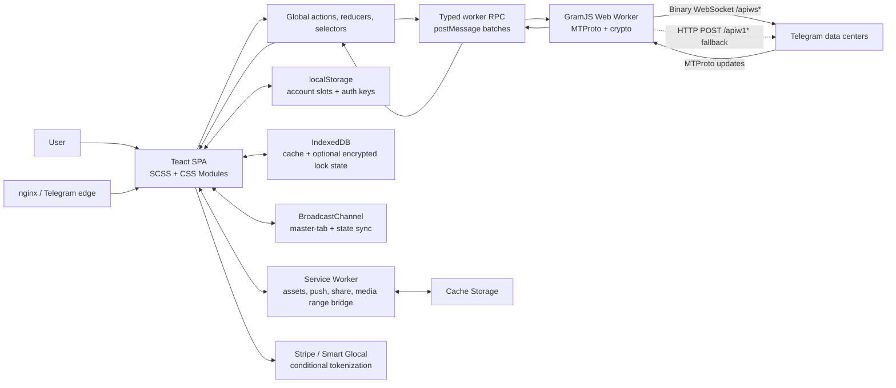

# Telegram Web A architecture audit

## Executive overview

Telegram Web A is a client-heavy single-page application and PWA. It does not behave like a conventional web application with JSON REST pages backed by a cookie session. The browser runs a Telegram protocol client: a custom GramJS/MTProto implementation executes in a Web Worker and communicates with Telegram data centers over binary WebSockets, with HTTP POST transport as a fallback. UI-to-network calls are typed worker RPC, not GraphQL or ordinary application REST.

The frontend is TypeScript and Teact, Telegram Web A's small React-paradigm framework. The deployed assets identify Teact, FasterDOM, Vite/Rolldown-style chunks, workers, and feature bundles. The version-matched public repository confirms Vite 8, SCSS and CSS Modules, a home-grown global action/reducer layer, service-worker caching, IndexedDB utilities, hash routing, and explicit lazy bundles for auth, main UI, calls, rich editing, commerce, and secondary features.

The product is built around a responsive column stack:

- Desktop keeps a 20rem chat rail visible and reserves the remainder for the conversation; a profile/settings column can open on the right.
- Tablet makes the left column hideable.
- Mobile makes left, middle, and right panels full-screen transitions, preserving one focused task at a time.

This architecture appears intentionally optimized for chat throughput, low-latency updates, offline-friendly assets, large media, multi-tab coordination, and platform-like behavior. The costs are significant client complexity, a large long-session JavaScript surface, limited semantic HTML landmarks, and security sensitivity around browser-held MTProto auth keys.

## Audit coverage and constraints

The audit covered the public QR, phone, passkey, account-code, download, and share routes; the authenticated shell; conversation composer structure; menus; settings; responsive dimensions; public assets; response headers; console output; and the public version-matched source.

The test account was used through Telegram's normal login flow. The application completed authentication through its normal cross-tab/session behavior. No message was sent and no setting was modified. Potentially destructive settings such as session termination, cache clearing, logout, passcode changes, and privacy changes were not activated.

## Technology stack

| Layer | Technology | Evidence | Confidence |
|---|---|---|---|
| Language | TypeScript/TSX | Public repo language and `src/**/*.ts(x)`; package version matches runtime | Confirmed |
| UI framework | Teact | Deployed `teact-*.js`; public README and imports from `lib/teact` | Confirmed |
| Rendering | Client-rendered SPA | Minimal 5.8 KB HTML shell, `#root`, module entry, live DOM injection | Confirmed |
| Build | Vite 8 with Rolldown output | `vite@^8.2.1`, `vite.config.ts`, deployed `rolldown-runtime-*.js` | Confirmed |
| Styling | SCSS, global layered CSS, CSS Modules, custom properties | Public styles and deployed component CSS chunks | Confirmed |
| State | Custom global action/reducer/selectors + Teact HOC/signals | `global/actions`, `reducers`, `selectors`, `withGlobal` | Confirmed |
| Protocol client | Custom GramJS implementing MTProto | README and `src/api/gramjs`; typed TL schema | Confirmed |
| Primary transport | Binary WebSocket to Telegram DC `/apiws*` | `PromisedWebSockets.ts` | Confirmed in source; actual DC host not captured |
| Fallback transport | Binary HTTP POST `/apiw1*` | `HttpStream.ts` | Confirmed in source |
| Worker RPC | Dedicated module Worker plus postMessage batching | Deployed workers and worker connector source | Confirmed |
| Persistence | localStorage, IndexedDB via `idb-keyval`, Cache Storage | Source plus PWA runtime assets | Confirmed |
| PWA | Manifest, service worker, push, share target, install prompt | Meta/link tags, worker asset, service-worker source | Confirmed |
| Media | Progressive range bridge, object URLs, Canvas, WebAssembly/Lottie, Opus | Source and media worker assets | Confirmed |
| Rich editor | Tiptap/ProseMirror, Lowlight | Version-matched package and editor source | Confirmed |
| Payments | Stripe token API and Smart Glocal tokenization for supported invoices | Payment source | Confirmed in source; not runtime exercised |
| Desktop wrapper | Tauri 2 | Repo `tauri/` and dependencies | Confirmed as supported target, not web runtime |
| Web server | nginx 1.30.1 | Response `Server` header | Confirmed |
| CDN/edge | Telegram-controlled edge or reverse-proxy tier | `x-served-by: meta...`, cache headers | Strong inference; vendor unknown |
| Analytics | No analytics SDK/request observed | CSP, assets, package manifest, observed resources | Strong inference for audited flows |

## Evidence table

| URL/source | Observation | Interpretation | Confidence |
|---|---|---|---|
| `/a/` | HTTP 200; 5,806-byte HTML; `nginx/1.30.1`; `max-age=3600`; `X-Frame-Options: deny` | Static SPA shell served by nginx/edge | Confirmed |
| `/a/` DOM | `#root`, `#portals`, module script, auth transition | Client rendering with portal layer and animated screen state | Confirmed |
| `/a/assets/index-IZ97MA_m.js` | Hashed module; deployed `.map` returns 200 | Production source maps are public | Confirmed |
| `/a/assets/teact-*.js` | Named Teact chunk | Custom framework is deployed | Confirmed |
| `/a/assets/fasterdom-*.js` | Named FasterDOM chunk | Explicit DOM read/write scheduling | Confirmed |
| `/a/worker-J7_WDuX0.js` | 742,096 raw bytes; 240,922 compressed bytes | Heavy protocol/worker logic is off-main-thread | Confirmed |
| `/a/index.worker-DLzlUYNq.js` | Separate small worker entry | Multiple worker roles/code splitting | Confirmed |
| Runtime asset inventory | Auth flow: 37 scripts, 11 styles, 56 total assets; exercised authenticated flow: 55 scripts, 23 styles, 95 total | Progressive feature loading; long-session surface grows materially | Confirmed for observed state |
| `t.me`, `telegram.me`, `telegram.dog` `_websync_` | Requests include `authed=0/1&version=12.0.38+A` | Cross-domain Telegram web-session synchronization | Confirmed |
| Public package manifest | Package version `12.0.38`, matching runtime | Public source is version-correlated evidence | Confirmed |
| Worker transport source | `wss://<dc>:443/apiws[_test][_premium]` and HTTP `/apiw1*` fallback | Direct MTProto data-center connectivity | Confirmed in public source |
| Session source | MTProto auth keys stored in account-slot localStorage; encrypted passcode copy in IndexedDB | Browser-held session, not server cookie session | Confirmed in public source |
| Main response | No `Set-Cookie` header | No cookie issued for the SPA document | Confirmed for that response |
| CSP meta | `script-src 'self' ...`; `object-src 'none'`; `form-action 'none'`; broad `connect-src` and `frame-src` | Strong script restriction, broader network/embed allowance required by client features | Confirmed |
| Auth UI | QR, phone number, passkey, keep-signed-in, code, password/registration states in source | Multiple authentication paths and progressive disclosure | Confirmed |
| Desktop runtime | Left 320 px panel at x=16; middle remainder; right column initially closed | Persistent rail + workspace layout | Confirmed at 1280×720 |
| Mobile runtime | 390 px left/middle/right panels moved with fixed-position transitions | Single-pane navigation stack | Confirmed at 390×844 |
| Settings runtime | General, privacy, storage, notifications, folders, performance, stickers, language, devices | Broad settings IA and nested left-column pane model | Confirmed |
| Console | No errors or warnings captured in exercised authenticated conversation state | Clean observed session; not proof of universal absence | Confirmed for observed state |

## Route and feature map

| Route or state | Behavior | Notes |
|---|---|---|
| `/a/` | SPA shell; QR login on desktop without a stored session | Canonical URL omits trailing slash |
| `/a/#login` | Login state | Used by account-slot links |
| `/a/?account=2#login` | Additional account slot | Menu exposes Add Account |
| `/a/#<numeric-chat-id>` | Conversation/thread route | Hash preserves static shell and client state |
| `/a/#<chat>_<thread>_<type>` | Thread, pinned, or scheduled list | Confirmed by routing source |
| `/a/get/` | User-agent redirect | On audited Mac runtime it redirected to `/a/get/mac.html` |
| `/a/get/mac.html` | Telegram A desktop download selector | Newer/older Mac choice and version text |
| `/a/share/` | Web Share Target handled by service worker | Without share payload, audited navigation returned to the app |
| App main | Chat list, search, stories, new message, account menu | Confirmed runtime |
| Conversation | Header, message list, search/date, attachment menu, rich composer, emoji/sticker/GIF, voice recording | Confirmed runtime structure |
| Right column | Profile, shared media, members, management, statistics, stories | Confirmed source; profile shell inferred from main composition |

For the larger feature inventory, see [features.md](./features.md).

## Request and API map

| Feature group | Browser-side call pattern | Remote interface |
|---|---|---|
| Auth/session | UI action → global action → `callApi` → worker message | MTProto auth methods over binary transport |
| Chats/messages | Selectors/actions → worker RPC; update stream returns batched updates | MTProto messages/chats methods |
| Search | Offset/rate/peer/id parameters; typed source methods | MTProto search methods |
| Pagination | `offsetId`, `addOffset`, direction, bounded viewport slices | MTProto history/search/topic methods |
| Media download | UI requests worker chunks; service worker exposes local progressive/download URLs | MTProto media download methods |
| Calls | Lazy calls bundle + WebRTC/SCTP signaling logic + Telegram call methods | Telegram call infrastructure; exact servers not audited |
| Push | Browser PushManager + service-worker push handler | Telegram device registration via MTProto |
| Payments | Invoice state via MTProto; card tokenization direct to provider | `api.stripe.com/v1/tokens` or validated Smart Glocal host |
| Mini apps/web content | Browser modal/iframe allowed by CSP | Third-party HTTPS content; per-feature hosts vary |
| Cross-tab | BroadcastChannel and master-tab election | No remote request; one tab owns primary API worker |
| Cross-domain session | `_websync_` scripts on Telegram-owned domains | Telegram web-session synchronization |

No GraphQL, framework server actions, or conventional application REST API was observed. REST-like HTTP is limited to transport fallback and specialized third-party integrations.

## Authentication and session analysis

- The client exposes QR, phone number, passkey, code, password, and registration states.
- The runtime source stores per-data-center MTProto auth keys in account-slot localStorage. That is expected for a direct protocol client but makes same-origin script compromise especially consequential.
- Optional local passcode locking encrypts session/global JSON in IndexedDB with AES-GCM. The key is a SHA-256 hash of passcode plus a fixed string. This provides local confidentiality but uses a fast, constant-salt derivation; a memory-hard or iterated KDF with a random per-install salt would better resist offline guessing.
- Multi-account support uses `?account=N`; cross-tab coordination uses BroadcastChannel and master-tab election to avoid duplicate protocol ownership.
- The main HTML response did not issue a cookie. CSRF tokens were not observed because state-changing Telegram operations are not authenticated by ambient cookies; they travel inside the authenticated MTProto session.
- Server authorization cannot be validated from the client. UI visibility is not a security boundary; Telegram's servers must enforce chat, member, admin, payment, and privacy permissions.
- CSP meaningfully narrows script execution, but `connect-src` allows broad `http:`/`https:` and `frame-src` allows broad web origins plus wallet schemes. This supports mini apps and wallet flows at the cost of a wider exfiltration/embed surface if same-origin script execution is compromised.

## UI component and design-system analysis

The likely top-level component tree is directly visible in public source:

```text
App
├─ UiLoader + Notifications
├─ Auth / LockScreen / Inactive screen
└─ Main
   ├─ FoldersSidebar
   ├─ LeftColumn (menu, search, stories, chat list, settings stack)
   ├─ MiddleColumn (header, panes, virtualized message list, composer)
   ├─ RightColumn (profile, shared media, management, statistics)
   └─ Portal/overlay layer (modals, media viewer, calls, stories, menus, payments)
```

Repeated primitives include `Button`, `ListItem`, `MenuItem`, `InputText`, `Checkbox`, `Transition`, `Modal`, `Avatar`, `Icon`, `Skeleton`, `Spinner`, pane headers, scroll containers, pickers, and virtualized lists. Global CSS layers and custom properties supply tokens; newer pieces use CSS Modules with hashed production classes.

Key design decisions appear intentional:

- **Column persistence:** keeps chat selection and conversation context visible at desktop widths, improving scanning throughput and spatial memory.
- **Single-pane mobile stack:** reduces cognitive load and gives touch targets the full width; back navigation becomes explicit.
- **48 px composer and primary controls:** supports touch reach while staying compact.
- **Search at the top of the chat rail:** optimizes the dominant retrieve-and-switch task.
- **Bottom-right New Message FAB:** a familiar, thumb-reachable creation affordance separated from browsing.
- **Progressive settings panes:** the overview remains visible on large screens while a nested pane opens beside it; on mobile the same model becomes a full-screen slide.
- **Platform classes and timing tokens:** iOS, Android, and macOS receive different typography/transition tuning, preserving native feel without separate apps.
- **Theme custom properties:** allow light/dark/custom wallpaper recoloring without rerendering every component.
- **Animation/performance user controls:** recognize that stickers, autoplay, and UI animation have device and accessibility costs.

See [ui-ux.md](./ui-ux.md) for detailed tokens and rationale.

## Performance and accessibility findings

### Confirmed measurements

- Main HTML: 5,806 bytes; public curl response around 0.13 seconds from the audit environment.
- Key raw/compressed sizes:

| Asset | Raw | Compressed transfer |
|---|---:|---:|
| Entry JS | 28,951 B | 12,418 B |
| Main feature JS | 420,528 B | 148,175 B |
| Editor JS | 294,925 B | 110,610 B |
| Extra features JS | 796,897 B | 290,444 B |
| Protocol worker JS | 742,096 B | 240,922 B |
| Base CSS | 92,523 B | 31,503 B |
| Main CSS | 61,287 B | 15,591 B |
| Extra CSS | 209,067 B | 57,950 B |

- Hashed static assets are gzip-compressed but were served with only `max-age=3600`, not a long immutable cache policy.
- Production source maps are publicly retrievable.
- The exercised authenticated session loaded 55 script and 23 stylesheet resources after settings/conversation exploration. This is not the cold-start set.
- No console error or warning was captured in the final observed conversation state.

### Quality judgments

- Worker isolation, list windowing, code splitting, batched worker messages, FasterDOM scheduling, cache-first assets, progressive range media, and delayed bundle warming are sophisticated performance choices.
- The large `extra` and protocol-worker bundles are credible long-session costs. The editor bundle is also large for users who never need rich editing.
- A one-hour HTTP cache for content-hashed JS/CSS underuses fingerprinting. A year-long immutable policy would reduce repeat bandwidth; service-worker caching partially compensates.
- Public source maps help support/debugging but reveal readable source structure. This is a product/security trade-off, not by itself a vulnerability.
- The document disables user scaling (`user-scalable=no`, `maximum-scale=1.0`), which is an accessibility concern for users who rely on pinch zoom.
- The live DOM provides many useful accessible names, but it has no semantic `main`, `nav`, `aside`, or `header` landmarks in the inspected conversation view. Icon-font glyphs also appear as noise in accessibility snapshots, several disabled buttons were unnamed, and one control exposed an untranslated key-like label.
- Keyboard focus styling is present in source, but full keyboard-only and screen-reader task completion was not executed. Contrast was not instrumented.
- SEO metadata is complete for the product shell, but meaningful chat content is correctly client-only/private; SEO has low relevance beyond the landing shell.

## Likely architecture



### Inference boundaries and alternatives

- **Frontend:** confirmed Teact SPA. Tauri is an additional packaging target, not evidence that the web page itself runs in Tauri.
- **Backend:** the browser speaks MTProto to Telegram data centers. The implementation behind those endpoints is private and unknown.
- **Data:** chats and authoritative account data are server-side; the browser stores auth keys, normalized client state, media/cache artifacts, and preferences. Exact server databases are unknown.
- **Hosting:** nginx and a Telegram `x-served-by` edge are visible. The physical cloud, load balancer, origin layout, and CDN vendor are unknown.
- **Deployment:** Vite emits content-hashed assets and source maps. CI/CD, canary strategy, rollback, and artifact promotion are unknown.

## Confirmed facts versus inferences

### Confirmed

- TypeScript + Teact + Vite/Rolldown + SCSS/CSS Modules.
- Custom GramJS/MTProto in a Web Worker with WebSocket and HTTP fallback transports.
- Service worker, manifest, push/share/media handlers, localStorage, IndexedDB, Cache Storage, BroadcastChannel.
- Hash routing and responsive breakpoints at 600 px, 925 px, and wide-screen 1276 px.
- nginx 1.30.1 response, one-hour cache headers, gzip, public source maps.
- Conditional Stripe and Smart Glocal payment tokenization in public source.
- No GraphQL and no application-server-action model in the inspected client.

### Strong inferences

- Telegram operates a proprietary edge/reverse-proxy tier in front of static origins.
- UI state is normalized and optimized for incremental updates and memoized selectors.
- Avoiding third-party analytics is an intentional privacy/performance decision in the main client.

### Possible

- Production rollout may use a permanent-version mechanism or staged asset cohorts; the client contains version pinning logic, but rollout control was not observed.
- Some payment invoices may use provider-hosted web views rather than native Stripe/Smart Glocal tokenization.

### Unknown

- Server language/framework, databases, message storage topology, queueing, observability, CDN vendor, infrastructure region layout, and deployment orchestration.

## Technical decisions that appear intentional

1. Run protocol, cryptography, and binary parsing off the main thread.
2. Elect one master tab and synchronize others to reduce duplicate sockets and updates.
3. Keep protocol-native typed methods instead of introducing a web-specific REST/GraphQL facade.
4. Window large lists and page by offsets/IDs.
5. Separate core, auth, main, editor, calls, stars, and extra features into lazy bundles.
6. Use a service worker as both cache and media-range broker.
7. Make theming and platform adaptation token-driven.
8. Prefer optimistic/progressive UI with local normalized state.
9. Keep analytics absent from the core path.
10. Support PWA and Tauri from one component architecture.

## Potential trade-offs and weaknesses

- Direct MTProto in-browser produces a complex, security-sensitive client and large workers.
- MTProto auth keys in localStorage increase the impact of same-origin XSS.
- Optional passcode derivation is fast SHA-256 with a constant salt; improve offline-guess resistance.
- Broad CSP `connect-src` and `frame-src` expand the allowed network/embed surface.
- Public production source maps expose implementation details.
- Hashed assets receive only one-hour HTTP caching.
- Long sessions can accumulate large feature bundles; delayed warming may fetch features the user never uses.
- Lack of semantic landmarks and noisy icon-font text weakens assistive navigation.
- Disabled user zoom is an avoidable accessibility regression.
- Custom framework and bespoke state/protocol layers concentrate maintenance knowledge.
- Heavy animation/media capability increases QA breadth across browsers and low-end devices.

## Questions requiring private source or infrastructure access

1. How are data-center endpoints selected, load-balanced, and failed over in production?
2. Which server-side authorization checks correspond to each admin, payment, and privacy action?
3. What release rings, canary signals, rollback rules, and permanent-version policies are used?
4. What telemetry exists if no third-party analytics is used, and how is privacy preserved?
5. What are the P95/P99 startup, sync, message-send, search, and media-start metrics by device class?
6. Which client caches are bounded, evicted, or invalidated by account and version?
7. How are source maps protected or intentionally published in release policy?
8. What threat model justifies localStorage auth keys and the current passcode KDF?
9. How are mini-app/web-view origins allow-listed beyond the broad CSP frame directive?
10. What accessibility test matrix and assistive-technology acceptance criteria are enforced?

## Prioritized recommendations for a similar internal application

### P0 — architecture and security foundations

1. Keep transport/crypto/binary parsing in a Worker, but isolate secrets behind a narrow typed RPC boundary.
2. If your internal app can use a conventional backend-for-frontend, prefer secure HttpOnly same-site cookies over browser-held protocol auth keys. Only adopt direct protocol auth when the product truly needs it.
3. Use a strong KDF such as Argon2id or appropriately costed PBKDF2/scrypt with a random per-install salt for local passcode encryption.
4. Make CSP origin-specific. Avoid broad `http:`/`https:` connect and frame directives unless required; separate mini-app surfaces onto constrained origins.
5. Treat server authorization as authoritative and test every role transition independently of UI visibility.

### P1 — product structure and performance

6. Reuse the responsive three-panel/one-panel model; define the panel state machine before building individual screens.
7. Normalize chat/message state, stream incremental updates, and window lists from day one.
8. Split rare features, but measure delayed prefetch. Warm bundles from intent signals or idle budget rather than fixed time alone.
9. Give content-hashed assets `Cache-Control: public, max-age=31536000, immutable`; keep only the HTML/version manifest short-lived.
10. Budget JavaScript by cold start, first conversation, and long session—not only one total bundle number.

### P1 — accessibility

11. Preserve pinch zoom; do not ship `user-scalable=no` unless an exceptional kiosk requirement is documented.
12. Use real `main`, `nav`, `aside`, and `header` landmarks and stable accessible names for every icon-only control.
13. Prefer SVG/icon components hidden from assistive text over icon-font glyphs that leak into names.
14. Test keyboard-only, screen-reader, reduced-motion, zoom 200–400%, and high-contrast flows as release gates.

### P2 — maintainability and operations

15. Document the worker RPC schema, global-state invariants, pagination semantics, and cache ownership as deep modules.
16. Keep public/source-map policy explicit. If maps are required for observability, upload them privately and avoid public deployment.
17. Instrument protocol connection state, update lag, list rendering, media first-frame, cache hit rate, and worker failures without capturing message content.
18. Preserve the strongest Telegram patterns—clear panel hierarchy, optimistic feedback, local cache, and user-controlled animation—without copying feature breadth before core messaging is reliable.
